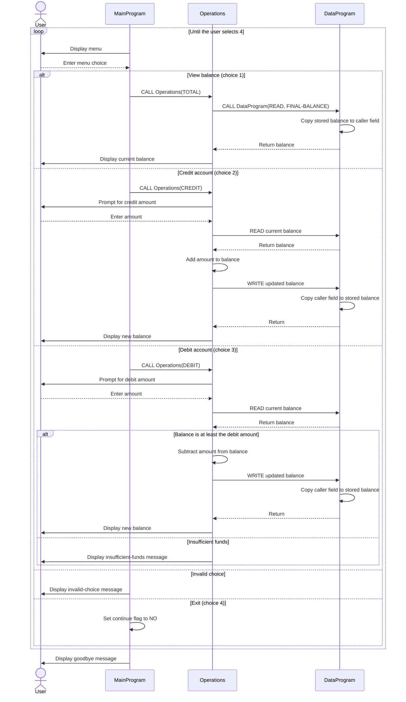

# COBOL Student Account Management System

This directory documents the COBOL account-management example in `src/cobol/`. The program is a small, interactive demonstration of viewing and changing an account balance; it does not model student identity or multiple accounts.

## Source Files

### `src/cobol/main.cob` — `MainProgram`

Runs the command-line menu and dispatches operations to `Operations`.

- Displays options to view the balance, credit the account, debit the account, or exit.
- Reads the user's selection and calls `Operations` with `TOTAL`, `CREDIT`, or `DEBIT`.
- Repeats until the user selects exit; other selections display an invalid-choice message.

### `src/cobol/operations.cob` — `Operations`

Implements the account actions and their console prompts and messages.

- `TOTAL`: reads and displays the current balance.
- `CREDIT`: accepts an amount, reads the current balance, adds the amount, saves the result, and displays the new balance.
- `DEBIT`: accepts an amount and reads the current balance. It subtracts and saves the amount only when the balance is at least that amount; otherwise it reports insufficient funds.

### `src/cobol/data.cob` — `DataProgram`

Provides the balance storage interface used by `Operations`.

- `READ`: copies the stored balance to the caller's balance field.
- `WRITE`: copies the caller's balance field into storage.
- Initializes the stored balance to `1000.00`.

## Student Account Rules and Current Limits

- The example maintains one shared balance, initialized to `1000.00`; it has no student ID, account selection, or per-student records.
- Balance and amount fields use `PIC 9(6)V99`, representing up to six integer digits and two decimal digits.
- A debit succeeds only when the balance is greater than or equal to the requested amount. A failed debit leaves the stored balance unchanged.
- Credits are added directly. The current code does not reject zero or negative amounts or enforce a maximum balance.
- The balance is held in program storage and is not persisted to a file or database, so this is a demonstration rather than a durable student-account system.

## Application Data Flow

